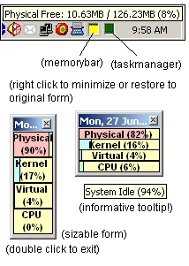



## Memory Bar 1\.5b

### Description

This is an improved version of the "small, neat and simple Memory Bar" app i submitted several days back. I have squeezed the app size 50% smaller than the previous version. full details of each bar is only displayed in the tooltiptext of each respective label. since windows time is already in the system tray, i chose to added a date caption to complement it. same as before, double click to close it, u can resize it however you want, and it stays on top of your apps. if there's any request to add more stuffs to it, i might consider an upgrade for further version.

Codes on cpu usage comes from:-

http://www.pscode.com/vb/scripts/ShowCode.asp?txtCodeId=27505&amp;lngWId=1

*Version 1.4: Fixed the picHook visible to false.

*Version 1.5: Added minimize to tray function (source comes from allapi.net)

*Version 1.5b: Some ppl complained that the program crashed (runtime error) after running for a prolonged period (division by zero?), so i added a 'on error resume next' for the timer. i know it isnt good practice but some ppl actually wanted to run this on their desktop for a long time.
 
### More Info
 

             |
---                |---
**Submitted On**   |2005-06-24 10:42:14
**By**             |[Wong Yat Seng](https://github.com/Planet-Source-Code/PSCIndex/blob/master/ByAuthor/wong-yat-seng.md)
**Level**          |Intermediate
**User Rating**    |5.0 (25 globes from 5 users)
**Compatibility**  |VB 5\.0, VB 6\.0
**Category**       |[Windows API Call/ Explanation](https://github.com/Planet-Source-Code/PSCIndex/blob/master/ByCategory/windows-api-call-explanation__1-39.md)
**World**          |[Visual Basic](https://github.com/Planet-Source-Code/PSCIndex/blob/master/ByWorld/visual-basic.md)
**Archive File**   |[Memory\_Bar1905886262005\.zip](https://github.com/Planet-Source-Code/wong-yat-seng-memory-bar-1-5b__1-61310/archive/master.zip)

